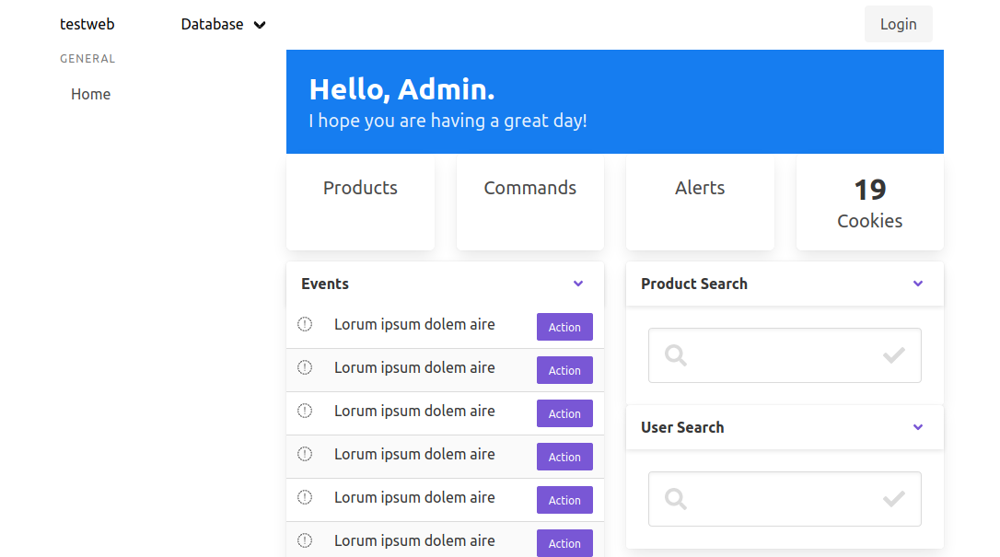

cl-cookieweb
============

A [cookiecutter](https://github.com/audreyr/cookiecutter) web template for Common Lisp.

Provides a working toy web app with the Hunchentoot web server, easy-routes, Djula templates, styled with Bulma, based on SQLite, with migrations and an example table definition.

Featuring:

- Recipe to run the project from sources or to build a binary, choosing your Lisp implementation
- Test suite using [Fiveam](https://common-lisp.net/project/fiveam/docs/)
- DB:
  - creation of a DB (SQLite by default. That is easily configurable)
  - a simple models.lisp with a Product table definition with the Mito ORM (see [Cookbook/databases#the Mito ORM](https://lispcookbook.github.io/cl-cookbook/databases.html#the-mito-orm-and-sxql))
  - migrations (built-in Mito feature)
- Djula templates
  - showing inheritance and custom filters
  - styled with [Bulma](https://github.com/jgthms/bulma)
  - showing a default dashboard
- JavaScript:
  - load static assets with a dummy JS file.
- run the project:
  - from sources
    - CLI args parsing (port, help)
    - port is also taken from an environment variable
  - build a self-contained binary
    - (xxx: static assets not included?)
  - Roswell integration to run the app as a script and to build, install and share binaries.

Based on [cl-cookieproject](https://github.com/vindarel/cl-cookieproject): a ready-to-use project template.

Might eventually appear:

- access roles
- login and logout
- JSON API example
- Vue.js integration
- HTMX example
- ~~ISSR example~~ [view here](https://github.com/vindarel/ISSR-productlist/)
- SystemD example



Usage
-----

Create a new project. You'll be prompted to provide some basic
information about your new project, which will then be auto-generated
in the current working directory:

```bash
$ pip install cookiecutter
$ cookiecutter https://github.com/vindarel/cl-cookieweb
project_name [cookie-web-project]:
repo_name [cookie-web-project]:
description []: A test project
version [0.0.1]:
year [1984]:
author [CL User]: me
email [me@mail.com]:
username [mme]:
branch [master]:
remote [origin]:
Initialised empty Git repository in /home/vince/bacasable/lisp-projects/cookie-web-project/.git/
Switched to a new branch 'master'
```

Run it straight away:

```bash
$ cd cookie-web-project
$ make run
rlwrap sbcl --load run.lisp
This is SBCL 2.0.10, an implementation of ANSI Common Lisp.
More information about SBCL is available at <http://www.sbcl.org/>.

SBCL is free software, provided as is, with absolutely no warranty.
It is mostly in the public domain; some portions are provided under
BSD-style licenses.  See the CREDITS and COPYING files in the
distribution for more information.
To load "cffi":
  Load 1 ASDF system:
    cffi
; Loading "cffi"
.
To load "cookie-web-project":
  Load 1 ASDF system:
    cookie-web-project
; Loading "cookie-web-project"
cookie-web-project version 0.0.1
Application started on port 4242.
*
```

You can see the `Hello` from the `main` function, and we are given a Lisp REPL.

Build an executable:

```bash
$ make build
[…]
[saving current Lisp image into /home/vince/bacasable/lisp-projects/cookie-web-project/cookie-web-project:
writing 0 bytes from the read-only space at 0x50000000
writing 736 bytes from the static space at 0x50100000
writing 37060608 bytes from the dynamic space at 0x1000000000
writing 2154496 bytes from the immobile space at 0x50200000
writing 13910016 bytes from the immobile space at 0x52000000
done]

$ ./cookie-web-project
cookie-web-project version 0.0.1
Application started on port 4242.
```

## Cookiecutter options

You can use command line options: https://cookiecutter.readthedocs.io/en/1.7.2/advanced/cli_options.html

- `--no-input`: do not prompt for parameters and only use cookiecutter.json file content
- ` --replay`: do not prompt for parameters and only use information entered previously
- ` -f, --overwrite-if-exists`: overwrite the contents of the output directory if it already exists
- ` -s, --skip-if-file-exists`: skip the files in the corresponding directories if they already exist
- ` -o, --output-dir`: where to output the generated project dir into
- ` --config-file`: user configuration file

# See also

Other demos and skeletons:

- [Feather](https://hg.sr.ht/~wnortje/feather), a template for web
  application development, shows a functioning Hello World app
  with an HTML page, a JSON API, a passing test suite, a Postgres DB
  and DB migrations. Uses Qlot, Buildapp, SystemD for deployment.
  - => probably a bit more serious as of yet.
- [lisp-web-template-productlist](https://github.com/vindarel/lisp-web-template-productlist),
  a simpler example (no DB models and it is not a project template, only a working example).
- [lisp-web-live-reload-example](https://github.com/vindarel/lisp-web-live-reload-example/) -
  a toy project to show how to interact with a running web app.

Resources:

- The CL Cookbook: https://lispcookbook.github.io/cl-cookbook/web.html
- libraries: https://github.com/CodyReichert/awesome-cl

Apps:

- [ABStock](https://github.com/vindarel/ABStock) - a products catalogue, made for bookshops
- [OpenBookStore](https://github.com/OpenBookStore/openbookstore) (WIP) - books management software. With user access roles, user login, a Vue.js page, API endpoints…

---

WTFPL

https://github.com/sponsors/vindarel/

<a href='https://ko-fi.com/K3K828W0V' target='_blank'></a>
